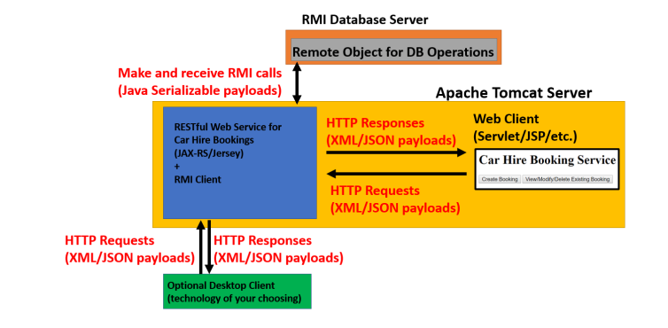

# A RESTful Car Hire Booking System

## Project Description
#### (A) Simple Web Client (Java JSP/Servlet or .NET equivalent if preferred) 
1. A Web Client will act as a GUI for the entire Car Hire Booking System. This GUI will allow a booking
to be Created, Read, Updated or Deleted. (N.B. do not spend too much time on the styling and layout
of the Web Client; basic unstyled HTML forms, tables and buttons etc. will suffice as this is not a
client-side web development project). The Web Client will communicate with the RESTful Web
Service below, using XML for marshalling and unmarshalling of data. 

#### (B) RESTful Web Service (JAX-RS/Jersey) 
1. Design a RESTful Web Service using JAX-RS/Jersey which will act as the gateway for all clients
which wish to use the Car Hire Booking System. Clients will be able to access CRUD functionality for
car hire bookings using the GET, POST, PUT and DELETE methods. This class will be responsible for
marshalling/unmarshalling data to/from XML for all Web Client requests/responses. This class will
also act as a client for the RMI Database Server. 

#### (C) Data Modelling
1. An appropriate data model will be required for all classes/entities which are part of a car hire booking
(e.g. Customer, Vehicle, Booking). This data model will be in the form of an XML Schema Definition.
The xjc (XML to Java Converter) utility may then be used to generate the appropriate Java classes from
the schema. 

#### (D) RMI Database Server
1. A remote interface called DatabaseService should expose remote methods which provide CRUD
(Create, Read, Update and Delete) functionality for each of the entities which have you modelled. This
interface definition must be available to the RMI Database Server and the RMI Client. Objects sent
or received via RMI will be required to implement the java.io.Serializable interface. 
2. An implementation of the DatabaseService interface called DatabaseServiceImpl will handle
persistence and CRUD functionality using a database of your choice (e.g. JDBC). 
3. ServiceSetup will contain a main method which instantiates DatabaseServiceImpl and binds the
Remote Object into the RMI registry using the name “databaseservice”. 

## Technologies used
- Eclipse EE 
- JAX-RS 
- JAXB 
 - Jersey 
 - Java 1.8 
- Tomcat Server 7.0 
- MySQL Server 5.7 
- Maven 

